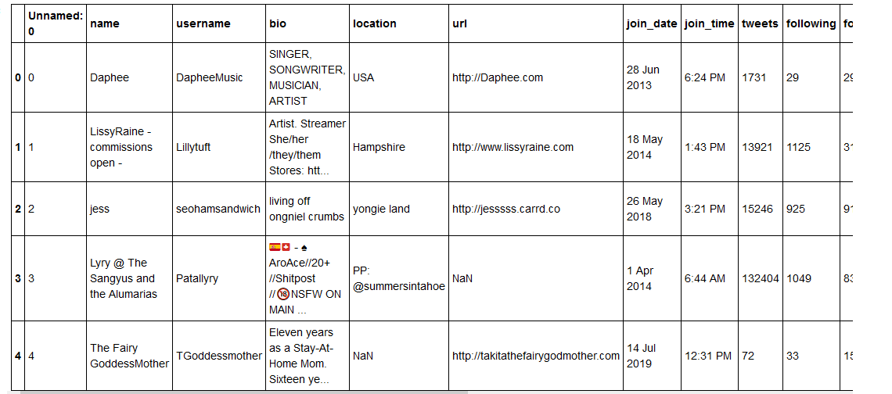

 <h1 align="center"> Depression Detection</h1>

 
  

This project aims to detect early indicators of depression by analyzing data from a range of social media platforms, including images and texts. 

---

<!-- List of table of contents -->

  
 Table of Contents

  <ol>
    <li> <a href="#data-collection--">Data collection </a> 
       <ol>
          <li> <a href="#visual-data">Visual Data</a> </li>
          <li> <a href="#textual-data">Textual Data</a> </li>
     </ol>
    </li>
    <li> <a href="#models--">Models </a> 
       <ol>
          <li> <a href="#models-for-images"> Models for images</a> </li>
          <li> <a href="#models-for-texts"> Models for texts</a> </li>
     </ol>
    </li>
    
   
   <li> <a href="#software-and-technologies--">Softwares and technologies</a> </li>
   <li> <a href="#hardware--">Hardware</a> </li>

  </ol>

 

---

## Data collection <a href="#top">&#8593; </a>
Data were collected from <a href="https://www.pexels.com/"> Pexels</a>, <a href="https://unsplash.com/"> Unsplash  </a> and <a href="https://twitter.com/?lang=ang"> Twitter </a>.  
Pexels and Unsplash are two freely-usable images platforms.  Tweets used are publicly available. 
### Visual Data: 
The overall process of scraping images from unsplash and pexels is presented as follows:

  

Images were crawled from Pexels using Selenium and from Unsplash using UnsplashAPI.  
<ul>
           <li> 6250 images labeled as "Depressed" </li>
           <li> 5234 images labeled as "Not Depressed" </li>
</ul>

This is a sample of the dataset: 

  

  
Images can be loaded as shown in <a href="Project Cheat Sheet.ipynb"> Project Cheat Sheet</a> and codes are available <a href="https://github.com/BouzidiImen/Social_media_Prediction_depression/tree/main/Scripts/Images_functions"> here <a>.
### Textual Data: 

Hashtags that were used are trending hashtags using Keywords inspired from DSM-5(Diagnostic and Statistical Manual of Mental Disorders). 
Textual data were collected from Twitter users sharing their posts publicly using twint.   
Overall, 5460 tweets were collected.
The process was:  
 
  

 
You can check the result of texts loader in <a href="Project Cheat Sheet.ipynb"> Project Cheat Sheet</a> and codes are available <a href="https://github.com/BouzidiImen/Social_media_Prediction_depression/tree/main/Scripts/Twitter_Crawler"> here <a>.
This is a sample of the dataset: 

  

  
## Models <a href="#top">&#8593; </a>
#### Models for Images:
 Trained five different types of models: 
 <ul>
   <li> Deep CNN </li>
   <li> ResNet50  </li>
   <li> BiT-L(ResNet50x1) </li>
   <li>BiT-L(ResNet50x3) </li>
   <li> BiT-L(ResNet101x1): This was the best model in term of Accuracy(0.82), Precisions, Recalls, and F1-scores with hyperparameters as follow SGD (Stochastic gradient descent) as optimizer, 50 epochs, leraning rate is variable and size of images is 128*128p </li>

</ul>
 
#### Models for Texts:
 Trained two different types of models: 
 <ul>
   <li>LSTM</li>
   <li> GloVe+BiLSTM: This was the best model in term of Accuracy(0.7), Precisions, Recalls, and F1-scores. </li>
</ul>

   
 
For the best models I actually chose, you can find three notebooks:   
 <ul>
   <li>For images: <a href="https://github.com/BouzidiImen/Social_media_Prediction_depression/blob/main/Test_Best_Model.ipynb">this notebook </a> presents the test of  BiT-L(ResNet101x1)  model which is the best model for classifying images.  </li>
   <li>For Texts:  <a href="https://github.com/BouzidiImen/Social_media_Prediction_depression/blob/main/Testing_models.ipynb">this notebook </a> presents the test of  GloVe+BiLSTM  which is the best model for classifying texts.  </li>
  <li>
   For integrating models: <a href="https://github.com/BouzidiImen/Social_media_Prediction_depression/blob/main/Integrating_Models.ipynb">this notebook </a> is to test the integration of BiT-L(ResNet101x1) and GloVe+BiLSTM to get a multimodal model. 
  </li>
</ul>

You can find the saved weights for images best model and texts best model <a href="https://drive.google.com/drive/folders/1R2nh2mDIhL1Z99O9XHPefwaaCNrKvFan?fbclid=IwAR1b-ZcUq7A9Xb8uV9Tv6m4ailydNWp6Pj3sr4SZ-Qm62U4tFPuVBoA_RvA">here</a>. 

 
 
## Software and technologies: <a href="#top">&#8593; </a> 
 
<ul>
   <li> Python (version 3.8.3) </li>
   <li> Anaconda (Distribution 2020.02) </li>
   <li> TensorFlow  </li>
   <li> Keras </li>
   <li> Jupyter Notebook</li>
   <li>Pycharm (Community Edition)</li>

</ul>
 
  
 
## Hardware <a href="#top">&#8593; </a>
 In the process of the implementation of our solution we used two main machines,
a local machine for refactoring codes, testing models and research, and a virtual
machine (VM) on Google Cloud Platform (GCP) to run models and codes that
are heavy in term of computation and time. Following are the specifications of
these machines:
<ul>
    <li> Local Machine: Lenovo E330:
        <ul>
            <li>Operating System : Kali Linux 2020.2</li>
            <li>CPU: Intel Core i5-3230M 2,6GHz</li>
         <li>RAM: 8 Go DDR3</li>
         <li>Disk: 320 GB HDD</li>
        </ul>
    </li>
 
 
 <li>Virtual Machine on GCP: mastermind
          I used two configurations: 
       <ul>
        <li> For tasks that are not heavy in both computation and time:
           <ul> <li>Operating System : Ubuntu 19.10</li>
            <li>Machine Type: n1-highmem-8</li>
          <li>CPU: 8 vCPUs</li>
          <li> RAM: 16 Go</li>
          <li> Disk: 100 GB SSD</li>
        </ul>
         </li>
            <li>
          For training models: <ul>
            <li>Operating System : Ubuntu 19.10</li>
            <li> Machine Type: n1-highmem-8</li>
          <li>CPU: 8 vCPUs</li>
          <li>RAM: 52 Go</li>
          <li>Disk: 100 GB SSD</li>
        </ul>
             </li>
         

 </li>

</ul>
         
 
 

 
 
---

### Finally, I hope you enjoyed my work and got inspired to help people get noticed :monocle_face:. If you want more details you can find my report <a href="https://github.com/BouzidiImen/Social_media_Prediction_depression/blob/main/Report.pdf">  here </a> . 

Please contact me for more details, I would be really happy to share more infos :yum:. 

 

 
 
